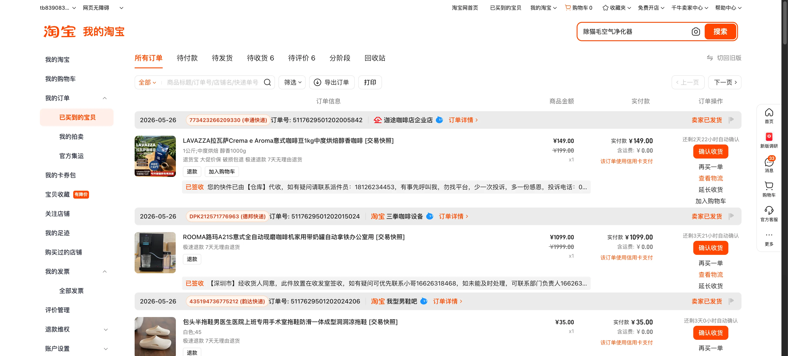

# Taobao Logistics Userscript

Shows Taobao tracking numbers directly on the orders page.



## What It Does

- Fetches logistics data from Taobao's order endpoint.
- Adds the tracking code inline near the item actions.
- Saves results in `localStorage` to avoid refetching after reload.
- Shows loading, retry countdowns, and skipped states.
- Skips unpaid/closed orders with `no tracking (unpaid/closed)`.
- Hides noisy recommendation/footer clutter.
- Uses small randomized request delays to reduce captcha risk.

## Install

1. Install Tampermonkey or Violentmonkey.
2. Create a new userscript.
3. Paste `taobao-logistics-copy.user.js`.
4. Open Taobao orders and reload the page.

## Dev Browser

Launch Helium with remote debugging:

```bash
make devtools-browser
```
